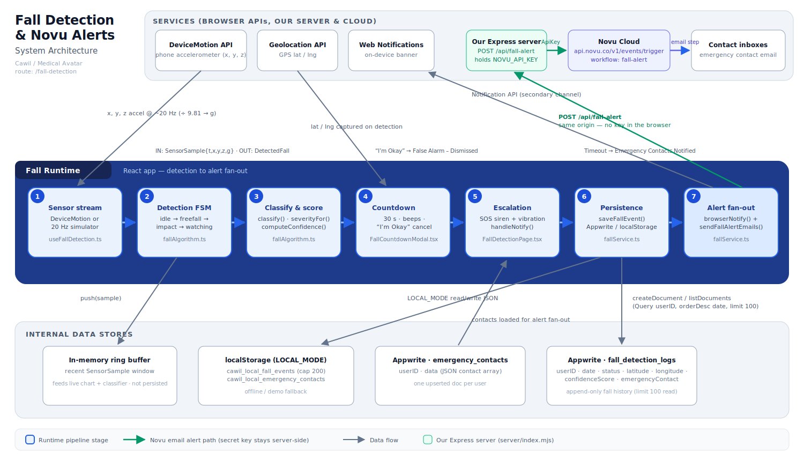
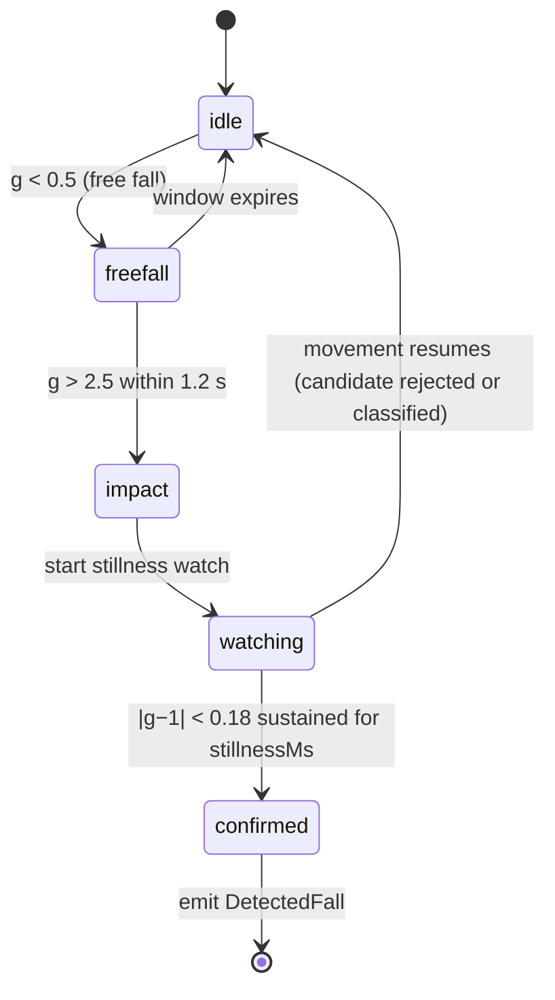

# Fall Detection & Novu Notification Architecture

> Cawil / Medical Avatar — technical architecture documentation for the fall-detection safety
> subsystem (`/fall-detection`) and its Novu-powered emergency-email pipeline.
>
> Branch: `feature/fall-detection` · Last updated: 2026-07-22

---

## 1. Overview

The fall-detection subsystem turns the patient's phone into a passive fall monitor. It streams
accelerometer data through a transparent, physics-based state machine (no ML), asks the user to
confirm they are okay after a suspected fall, and — if they do not respond within 30 seconds —
escalates: it sounds a local SOS siren, shows a browser notification, and emails every configured
emergency contact through **Novu** with the fall's severity, time, and a Google Maps link to the
patient's GPS position. Every incident (including dismissed false alarms) is persisted to Appwrite
and shown in the on-page **Fall History Log**, which can be exported as a doctor-readable JPG or
PDF report (see §10).

### File map

| File | Responsibility |
|---|---|
| `src/services/fallAlgorithm.ts` | Pure detection engine: thresholds, state machine, classification, severity, confidence. No React, no I/O. |
| `src/services/fallService.ts` | Persistence (Appwrite ⁄ localStorage), browser notifications, alert-server call, Web Audio SOS siren. |
| `server/index.mjs` | Express server: serves the built SPA and owns `POST /api/fall-alert`, the only place the Novu secret key lives. |
| `src/app/hooks/useFallDetection.ts` | Runtime hook: sensor streams (real DeviceMotion or simulator), detector loop, GPS capture, simulate/SOS triggers. |
| `src/app/pages/FallDetectionPage.tsx` | Page orchestrator: loads events/contacts, resolves the countdown outcome, persists + fans out alerts. |
| `src/app/components/fall/FallCountdownModal.tsx` | 30-second countdown → alarm state machine with "I'm Okay" cancel. |
| `src/app/components/fall/StatusBanner.tsx` | Monitoring on/off, sensor mode, GPS status chips. |
| `src/app/components/fall/LiveSensorFeed.tsx` | Real-time accelerometer SVG chart with threshold guides. |
| `src/app/components/fall/SosButton.tsx` | Manual SOS trigger. |
| `src/app/components/fall/EmergencyContactsWidget.tsx` | CRUD UI for emergency contacts. |
| `src/app/components/fall/FallHistoryLog.tsx` | Incident history table + JPG/PDF export buttons. |
| `src/services/fallReportExport.ts` | Doctor-report generator: offscreen A4 sheets → JPG / PDF download. |

The page is registered at route `/fall-detection` in `src/app/routes.ts` and linked from the
"Safety" section of `src/app/components/Sidebar.tsx`.

---

## 2. Architecture diagram

Styled after the Copilot-Studio "runtime pipeline" convention: external services across the top,
the numbered runtime pipeline in the middle, internal data stores along the bottom.



---

## 3. Runtime pipeline (stages 1–7)

| # | Stage | Where | What happens |
|---|---|---|---|
| 1 | **Sensor stream** | `useFallDetection.ts` | Real `DeviceMotion` events (m/s² ÷ 9.81 → g; iOS 13+ requires `DeviceMotionEvent.requestPermission()` from a user gesture) or a 20 Hz simulated stream of ~1 g noise for desktop demos. Each tick produces a `SensorSample { t, x, y, z, g }`. |
| 2 | **Detection state machine** | `fallAlgorithm.ts` → `createFallDetector()` | Samples are pushed through the 3-phase FSM `idle → freefall → impact → watching` (see §4). |
| 3 | **Classification & scoring** | `fallAlgorithm.ts` → `classify()`, `severityFor()`, `computeConfidence()` | Candidate events are filtered against false-positive heuristics; survivors get a severity band and a 0–100 confidence score, emitted as a `DetectedFall`. |
| 4 | **Countdown fail-safe** | `FallCountdownModal.tsx` | `raiseFall()` sets the pending fall and captures GPS via `navigator.geolocation`. The modal counts down 30 s with per-second beeps (higher/faster in the last 5 s). "I'm Okay" cancels. |
| 5 | **Escalation** | `FallCountdownModal.escalate()` → `FallDetectionPage.handleNotify()` | At zero the modal switches to its `alarm` phase, starts the looping Web Audio siren + vibration, and fires `onNotify` exactly once (`notifiedRef` guard). |
| 6 | **Persistence** | `fallService.saveFallEvent()` | The resolved `FallEvent` (either outcome) is written to Appwrite `fall_detection_logs` — or localStorage in `LOCAL_MODE` (see §6). |
| 7 | **Alert fan-out** | `fallService.notifyEmergencyContacts()` + `sendFallAlertEmails()` | Run in parallel (`Promise.all`): a browser Notification plus a single `POST /api/fall-alert` to our own server, which triggers one Novu event per eligible contact (see §7). Queued/failed counts surface as toasts (a 2xx from Novu means _queued for delivery_, not delivered). |

**Outcomes.** A pending fall always resolves to exactly one of two persisted actions:

- `"False Alarm – Dismissed"` — user tapped **I'm Okay** during the countdown.
- `"Emergency Contacts Notified"` — countdown expired (or manual SOS), alerts fanned out.

---

## 4. Detection algorithm (`fallAlgorithm.ts`)

A deliberately transparent physics model — every decision is explainable to a clinician.

### Thresholds

| Constant | Value | Meaning |
|---|---|---|
| `FREE_FALL_G` | **0.5 g** | Total acceleration below this ⇒ body is in free fall. |
| `IMPACT_G` | **2.5 g** | Spike above this ⇒ impact with the ground. |
| `STILL_TOL` | **0.18** | \|g − 1\| below this ⇒ the person is lying still. |
| `freeFallWindowMs` | **1 200 ms** | Impact must follow free fall within this window. |
| `stillnessMs` | **8 000 ms** default | Stillness required to confirm. The hook overrides this to **4 000 ms** for demos (`STILLNESS_MS` in `useFallDetection.ts`); the product spec calls for 15–60 s. |

### Phase state machine



### False-positive rejection — `classify()`

| Verdict | Trigger | Interpretation |
|---|---|---|
| `activity` | ≥ 3 recent impact spikes without stillness | Running / jumping / exercise. |
| `sit` | Impact below 2.5 g | Sat or lay down hard. |
| `drop` | Hard impact but movement resumed | Dropped the phone. |
| `fall` | Free fall → hard impact → sustained stillness | Confirmed fall — raised to the UI. |

### Severity — `severityFor()` (write-time, from impact force)

| Impact | Severity |
|---|---|
| ≥ 4 g | `high` |
| ≥ 3 g | `moderate` |
| otherwise | `low` |

### Confidence — `computeConfidence()` (0–100)

```
confidence = 50 % · impact magnitude + 35 % · stillness duration + 15 % · free-fall seen
```
clamped to 0–100 and persisted as `confidenceScore`.

### Core types

```ts
SensorSample { t, x, y, z, g }
DetectedFall { severity, confidence, impactG, stillnessMs, ... }
FallEvent    { id, ts /* ISO */, severity, type, action, impactG,
               stillnessMs, confidence?, emergencyContact?, lat?, lng? }
```

---

## 5. Countdown & escalation state machine (`FallCountdownModal.tsx`)

```
          pendingFall raised
                 │
                 ▼
        ┌─── countdown (30 s) ───┐        beep() each second;
        │  "I'm Okay" button     │        last 5 s: higher pitch, faster
        └───────┬───────┬────────┘
   tapped "I'm  │       │ reaches 0
   Okay"        ▼       ▼
   stopSosAlarm();   escalate():
   log "False        phase = 'alarm'; startSosAlarm()
   Alarm –           (looping siren + vibration);
   Dismissed"        onNotify() fired ONCE (notifiedRef)
                        │
                        ▼
                 alarm phase — only a "Stop SOS" button
```

Guarantees worth knowing:

- `onNotify` can never double-fire — a `notifiedRef` guard latches after the first call.
- Unmount cleanup always clears the timer and stops the alarm, so the siren cannot keep ringing
  after navigation.
- The shared `AudioContext` is unlocked on a user gesture (`ensureAudio()`), so the alarm can
  sound later even though browsers block autonomous audio.
- ⚠ A web app cannot bypass the iOS silent switch / DND, and iOS Safari has no Vibration API —
  a native wrapper is future work.

---

## 6. Data model & persistence (`fallService.ts`)

### Appwrite `fall_detection_logs` (`VITE_COLLECTION_FALL_EVENTS`) — append-only history

| Attribute | Type | Source (`FallEvent`) |
|---|---|---|
| `userID` | string | current user id |
| `date` | datetime | `event.ts` (ISO) |
| `status` | string | `event.action` — `"False Alarm – Dismissed"` \| `"Emergency Contacts Notified"` |
| `latitude` / `longitude` | double | GPS captured at detection (nullable) |
| `confidenceScore` | double | `event.confidence` 0–100 (nullable) |
| `emergencyContact` | string | comma-joined names of alerted contacts (nullable) |

Read path: `Query.equal('userID', …)` + `Query.orderDesc('date')` + `Query.limit(100)`.

### Appwrite `emergency_contacts` (`VITE_COLLECTION_EMERGENCY_CONTACTS`)

One upserted document per user: `{ userID, data }` where `data` is a JSON-encoded
`EmergencyContact[]` — each `{ id, name, phone, email?, pref?: 'phone' | 'email' | 'both' }`.

### LOCAL_MODE fallback

When `LOCAL_MODE` is true, reads/writes mirror to localStorage instead of Appwrite:
`cawil_local_fall_events` (capped at 200 events) and `cawil_local_emergency_contacts`.

---

## 7. Novu notification subsystem

Novu is used for exactly one thing: **emailing emergency contacts when a fall is confirmed**
(stage 7). No SDK is installed — the trigger is a plain `fetch` against Novu's REST API, issued
by **our own server**, never the browser.

```
Browser                     Our server                    Novu Cloud            Contact
fallService.ts  ──POST──▶  server/index.mjs  ──POST──▶  /v1/events/trigger  ──▶  inbox
                /api/fall-alert    (holds NOVU_API_KEY)      workflow: fall-alert    (via SMTP)
                same-origin, no key
```

### Why it cannot run in the browser

Novu's REST API is **server-side only**. Called from page JavaScript it fails CORS outright, and
the `Authorization: ApiKey …` header requires the *secret* key, which a browser build cannot keep
secret. An earlier version of this code tried to work around the CORS wall by tunnelling through
public proxies (`corsproxy.io`, `yacdn.org`, `api.codetabs.com`); when those proxies started
refusing unknown origins, every alert failed with `TypeError: Failed to fetch` and no email was
ever sent. `server/index.mjs` removes the proxy, the CORS problem, and the exposed key together.

### App-side contract — `POST /api/fall-alert`

Request (built in `sendFallAlertEmails()`):

```jsonc
{
  "contacts": [{ "name": "Amber Clarisse", "email": "amber@example.com" }],  // max 25
  "location": { "lat": 14.5995, "lng": 120.9842 },                           // or null
  "event":    { "severity": "high", "ts": "<ISO 8601>", "impactG": 4.2 }
}
```

Response — the same `{ sent, failed, errors }` shape the UI has always consumed:

```jsonc
{ "sent": 1, "failed": 0, "errors": [] }
```

| Status | Meaning |
|---|---|
| `200` | At least one trigger was accepted by Novu (`errors[]` may still list partial failures). |
| `400` | Validation failed — bad email, empty/oversized `contacts`, malformed body. Nothing was sent. |
| `502` | Every trigger failed upstream; `errors[]` carries Novu's own messages. |
| `503` | `NOVU_API_KEY` is not set on the server — alerts are disabled, and this says so explicitly rather than silently succeeding. |

`GET /api/health` → `{ ok, novuConfigured, workflow }` — checks the deployment's env wiring
without staging a fall.

**Boundary validation** (in `parseAlertBody()`): `contacts` must be a non-empty array of at most
25 entries, every `email` must match a basic address pattern, names are trimmed to 120 chars,
`lat`/`lng` must be finite numbers or the payload degrades to `"Location unavailable"`, and a bad
`ts` falls back to "now". Novu error messages are echoed back; request headers never are.

### Trigger contract — workflow `fall-alert`

```
POST https://api.novu.co/v1/events/trigger
Authorization: ApiKey <NOVU_API_KEY>          ← server-side env var, no VITE_ prefix
{
  "name": "fall-alert",
  "to":   { "subscriberId": "<contact email>", "email": "<contact email>" },
  "payload": {
    "to_name":   "<contact name>",
    "severity":  "HIGH | MODERATE | LOW",
    "timestamp": "<localized date-time>",
    "maps_link": "https://maps.google.com/?q=<lat>,<lng>" | "Location unavailable",
    "message":   "A <severity> severity fall was detected. Impact: <n.n> g."
  }
}
```

- **Subscribers** are created/identified lazily by email address — no pre-registration step.
- **Recipient filter** (client-side, then re-validated server-side): contacts with a non-empty
  email whose `pref` is `email`, `both`, or unset. Contacts with `pref: 'phone'` are skipped —
  no SMS channel exists; phone is display-only.
- Contacts are triggered concurrently (`Promise.allSettled`), so one bad address cannot block
  the rest. Results aggregate to `{ sent, failed, errors[] }`, which
  `FallDetectionPage.handleNotify()` surfaces as toasts.
- **Novu-side setup required**: a workflow whose trigger identifier is `fall-alert`, with an
  email step templated on `to_name`, `severity`, `timestamp`, `maps_link`, `message`, and an
  active email provider behind it — see §7.1.
- Override the workflow id with `NOVU_WORKFLOW_ID`, and the API base with `NOVU_API_URL`
  (EU-region accounts must use `https://eu.api.novu.co`; the wrong region returns `401` and
  looks exactly like a bad key).

### 🔐 Key handling

`NOVU_API_KEY` is read by `server/index.mjs` at runtime and is **not** a build input, so it never
reaches `dist/`. Verify after any build:

```bash
npm run build && grep -c "$NOVU_API_KEY" dist/assets/*.js   # expect 0 everywhere
```

Never rename it back to `VITE_NOVU_API_KEY` — that prefix is precisely what publishes it.

---

## 7.1 Novu Custom SMTP integration

**This is the step that decides whether contacts actually receive mail.** A workflow with no
active email provider still returns `201 Created` from the trigger endpoint, the app still shows
*"1 email sent"*, and nothing is delivered. Novu's built-in development provider only delivers to
the account owner's own verified address, so emergency contacts get nothing until a real provider
is attached. Custom SMTP (Nodemailer under the hood) is the provider that lets you send from any
mailbox you control.

### Prerequisites

An SMTP mailbox you can authenticate against, and its host, port, username, and password. For
Gmail this means **2-Step Verification enabled + an App Password** — a normal account password is
rejected with `535-5.7.8 Username and Password not accepted`.

### Steps

1. Novu dashboard → **Integrations** → **Add a provider**.
2. Choose **Custom SMTP** (listed under the Email channel).
3. Fill the connection fields:

   | Field | Required | Notes |
   |---|---|---|
   | `host` | ✅ | e.g. `smtp.gmail.com` |
   | `port` | ✅ | see the TLS table below |
   | `username` | ✅ | usually the full mailbox address |
   | `password` | ✅ | app password / SMTP key, **not** the account login password |
   | **From email address** | ✅ | must be an address the SMTP account is allowed to send as |
   | `secure` | — | `true` for implicit TLS, empty otherwise — see below |
   | DKIM Domain / Private Key / Key Selector | — | optional; signs outgoing mail to improve deliverability |

4. Flip the toggle from **Disabled** to **Active**.
5. Click **Update**.

### Port & TLS

| Port | `secure` | Mechanism | When to use |
|---|---|---|---|
| **587** | leave empty | STARTTLS | The default choice; works with nearly every provider. |
| **465** | `true` | Implicit TLS | Use when the provider explicitly documents 465. |
| 25 | leave empty | plaintext/STARTTLS | Usually blocked by cloud hosts — avoid. |

Mismatching these is the most common failure: port 465 with `secure` empty typically **hangs
until timeout** rather than returning a clear error.

### Common provider settings

| Provider | Host | Port | Username | Password |
|---|---|---|---|---|
| Gmail / Google Workspace | `smtp.gmail.com` | 587 | full Gmail address | 16-char **App Password** |
| Brevo (ex-Sendinblue) | `smtp-relay.brevo.com` | 587 | Brevo login email | SMTP key from the dashboard |
| Mailtrap (testing) | `sandbox.smtp.mailtrap.io` | 587 | inbox username | inbox password |
| Outlook 365 | `smtp.office365.com` | 587 | full mailbox address | mailbox password / app password |

**Mailtrap is the right choice while testing this project** — it captures every message in a web
inbox instead of delivering it, so you can exercise the full fall → alert path repeatedly without
emailing a real emergency contact.

### Wire it to the `fall-alert` workflow

1. Open **Workflows** → the workflow whose trigger identifier is exactly `fall-alert` (this
   string must match `NOVU_WORKFLOW_ID`, default `fall-alert` — a mismatch returns
   `404 workflow_not_found`).
2. Confirm its **Email** step is bound to the Custom SMTP integration you just activated.
3. Confirm the email template references the payload variables the server sends:
   `{{to_name}}`, `{{severity}}`, `{{timestamp}}`, `{{maps_link}}`, `{{message}}`.
   Variables the template names but the payload omits render empty — they do not error.
4. Use the workflow's **Trigger**/test tab to send one message to yourself before testing the
   app end-to-end. This isolates "Novu + SMTP are configured" from "our server calls Novu
   correctly".

### Verifying from this repo

```bash
npm run build
npm run start:local                       # reads NOVU_API_KEY from .env

curl localhost:3000/api/health
# → {"ok":true,"novuConfigured":true,"workflow":"fall-alert"}

curl -X POST localhost:3000/api/fall-alert \
  -H 'Content-Type: application/json' \
  -d '{"contacts":[{"name":"Test","email":"you@example.com"}],
       "location":{"lat":14.5995,"lng":120.9842},
       "event":{"severity":"high","ts":"2026-07-22T10:00:00Z","impactG":4.2}}'
# → {"sent":1,"failed":0,"errors":[]}
```

Then check the Novu **Activity Feed**: it shows the trigger, the email step, and — crucially —
the provider's delivery result. `sent: 1` only proves Novu *accepted* the event.

### Troubleshooting

| Symptom | Cause | Fix |
|---|---|---|
| `TypeError: Failed to fetch` in the browser console | Something is calling Novu directly from page JS again, or the server isn't running | The browser must only ever hit `/api/fall-alert`; start the server (`npm start`) |
| `503` from `/api/fall-alert` | `NOVU_API_KEY` unset on the host | Set it in Railway/Render service variables (no `VITE_` prefix) |
| `401 Unauthorized` from Novu | Wrong key, or an EU-region account hitting the US endpoint | Re-copy the secret key; set `NOVU_API_URL=https://eu.api.novu.co` if the account is EU |
| `404 workflow_not_found` | Trigger identifier ≠ `fall-alert` | Rename the workflow's identifier, or set `NOVU_WORKFLOW_ID` |
| `sent: 1` but no email arrives | No active email provider, or SMTP auth failed | Activate Custom SMTP (§7.1); read the failure in the Activity Feed |
| Gmail `535-5.7.8` | Account password used instead of an App Password | Enable 2FA, generate an App Password, use that |
| Mail lands in spam | Unverified/mismatched From domain | Use a From address on a domain you control; configure DKIM |
| Trigger hangs, then times out | Port 465 with `secure` unset (or 587 with `secure: true`) | Match port and `secure` per the TLS table |

---

### Channel summary

| Channel | Mechanism | Role |
|---|---|---|
| Email | Novu workflow `fall-alert` | Primary remote alert to contacts |
| Browser notification | `Notification` API (`browserNotify`) | Secondary, on the patient's device |
| Siren + vibration | Web Audio + `navigator.vibrate` | Primary on-device fail-safe |
| SMS | — | **Not implemented** (contact `phone` is metadata only) |

---

## 8. Environment variables

| Variable | Purpose |
|---|---|
| `VITE_APPWRITE_ENDPOINT` / `VITE_APPWRITE_PROJECT_ID` / `VITE_APPWRITE_DATABASE_ID` | Appwrite client + database. |
| `VITE_COLLECTION_FALL_EVENTS` | Collection id for fall history (prod: `fall_detection_logs`). |
| `VITE_COLLECTION_EMERGENCY_CONTACTS` | Collection id for contacts (prod: `emergency_contacts`). |
| `VITE_LOCAL_MODE` | Intended offline/demo switch — but see §9. |

`VITE_*` variables are **inlined at build time** — the host must have them set when
`npm run build` runs, not just at boot. The variables below are read by `server/index.mjs` at
**runtime** and never enter the bundle:

| Variable | Purpose |
|---|---|
| `NOVU_API_KEY` | Novu secret key used by `POST /api/fall-alert`. Required for emails; without it the endpoint returns `503`. |
| `NOVU_API_URL` | Novu API base. Defaults to `https://api.novu.co`; EU-region accounts need `https://eu.api.novu.co`. |
| `NOVU_WORKFLOW_ID` | Trigger identifier. Defaults to `fall-alert`. |
| `PORT` | Listen port. Defaults to `3000`; Railway/Render inject their own. |

> ⚠ `VITE_NOVU_API_KEY` is **retired**. The `VITE_` prefix compiles the value into
> `dist/assets/index-*.js` for anyone to read. Delete it from every host's env config.

### Deployment

The app is **no longer a static site** — it needs a Node process for `/api/fall-alert`.

| | |
|---|---|
| Build | `npm ci && npm run build` (all `VITE_*` must be present here) |
| Start | `npm start` → `node server/index.mjs` |
| Node | ≥ 20 (global `fetch`; declared in `package.json` `engines`) |

- **Railway** — Nixpacks auto-detects Node and runs install → build → start. Add `NOVU_API_KEY`
  to the service variables; delete `VITE_NOVU_API_KEY`.
- **Render** — `render.yaml` declares `runtime: node`. A `runtime: static` site cannot serve the
  API endpoint and will reproduce the original "failed to fetch" bug.
- **Locally** — `npm run start:local` loads `.env` via Node's `--env-file-if-exists`; plain
  `npm start` expects the host to supply the variables.

---

## 9. Known inconsistencies & caveats

1. **Severity changes on round-trip.** At write time severity derives from impact force
   (`≥ 4 g → high`); on read-back it is *recomputed from confidence* via
   `severityFromConfidence` (`≥ 66 → high, ≥ 33 → moderate`). The same event can therefore
   display a different severity after a reload. Severity itself is never persisted.
2. **`impactG` and `stillnessMs` are not persisted** — events read from Appwrite report them
   as 0. This is why the doctor report (§10) shows the persisted `confidenceScore` instead of
   impact force.
3. **`LOCAL_MODE` is hard-coded `false`** in `src/lib/appwrite.ts` ("forced to ensure syncing"),
   while `routes.ts` still reads `VITE_LOCAL_MODE` for the default route — the flag is
   effectively split-brained.
4. **Demo stillness override**: the hook confirms falls after 4 s of stillness instead of the
   spec's 15–60 s, to keep demos fast.
5. **iOS limits**: no Vibration API in Safari; silent switch/DND cannot be bypassed from the web.
6. **`public/_headers` and `public/_redirects` are inert in production.** They are a
   Netlify/Cloudflare convention; the app is now served by Express, which ignores them. Their
   behaviour is reproduced in `server/index.mjs` — the `Permissions-Policy` /
   `Cross-Origin-Opener-Policy` headers and the SPA fallback route. If you edit one, edit the
   other: **dropping `accelerometer=*` silently stops `DeviceMotion` from firing**, which
   disables fall detection on real phones with no error message.
7. **`npm run dev` needs the API server too.** Vite proxies `/api` to `localhost:3000`
   (`vite.config.ts`), so run `npm run start:local` alongside `npm run dev` when testing alerts.

---

## 10. Fall history export (doctor report)

The **Fall History Log** card offers two export buttons (JPG, PDF) implemented in
`src/services/fallReportExport.ts`:

- A clean, light-themed A4 report (794 × 1123 px @ 96 dpi per page) is built as self-contained
  inline-styled HTML — patient name/email, generation date, covered period, summary counts, and a
  table of **Date · Time · Severity · Action Taken · Confidence · Location** (newest first,
  paginated with "Page i of n" footers).
- The sheets are mounted offscreen and rasterized with **`modern-screenshot`**
  (`domToCanvas`, 2× scale) — the live glassmorphism UI is never captured, avoiding
  `backdrop-filter`/oklch rasterization pitfalls.
- **JPG**: pages are stitched vertically onto one white-filled canvas → `image/jpeg` at 92 %.
- **PDF**: each canvas becomes one A4 page via **`jspdf`** `addImage` → `fall-history-YYYY-MM-DD.pdf`.
- Both libraries are dynamically imported so they don't weigh down the initial bundle.
- Buttons are disabled while exporting or when the history is empty; success/failure is reported
  via the app's standard sonner toasts.
