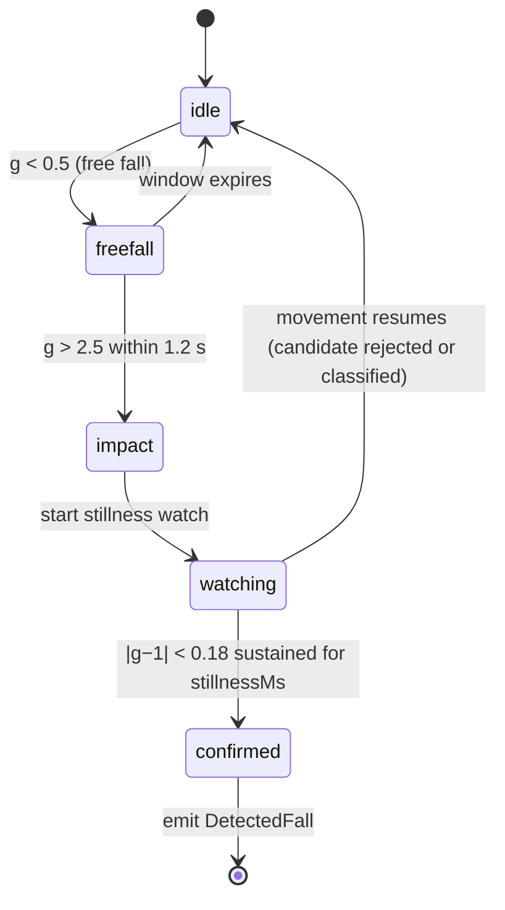

# Fall Detection & Novu Notification Architecture

> Cawil / Medical Avatar — technical architecture documentation for the fall-detection safety
> subsystem (`/fall-detection`) and its Novu-powered emergency-email pipeline.
>
> Branch: `feature/fall-detection` · Last updated: 2026-07-11

---

## 1. Overview

The fall-detection subsystem turns the patient's phone into a passive fall monitor. It streams
accelerometer data through a transparent, physics-based state machine (no ML), asks the user to
confirm they are okay after a suspected fall, and — if they do not respond within 30 seconds —
escalates: it sounds a local SOS siren, shows a browser notification, and emails every configured
emergency contact through **Novu** with the fall's severity, time, and a Google Maps link to the
patient's GPS position. Every incident (including dismissed false alarms) is persisted to Appwrite
and shown in the on-page **Fall History Log**, which can be exported as a doctor-readable JPG or
PDF report (see §10).

### File map

| File | Responsibility |
|---|---|
| `src/services/fallAlgorithm.ts` | Pure detection engine: thresholds, state machine, classification, severity, confidence. No React, no I/O. |
| `src/services/fallService.ts` | Persistence (Appwrite ⁄ localStorage), browser notifications, Novu email alerts, Web Audio SOS siren. |
| `src/app/hooks/useFallDetection.ts` | Runtime hook: sensor streams (real DeviceMotion or simulator), detector loop, GPS capture, simulate/SOS triggers. |
| `src/app/pages/FallDetectionPage.tsx` | Page orchestrator: loads events/contacts, resolves the countdown outcome, persists + fans out alerts. |
| `src/app/components/fall/FallCountdownModal.tsx` | 30-second countdown → alarm state machine with "I'm Okay" cancel. |
| `src/app/components/fall/StatusBanner.tsx` | Monitoring on/off, sensor mode, GPS status chips. |
| `src/app/components/fall/LiveSensorFeed.tsx` | Real-time accelerometer SVG chart with threshold guides. |
| `src/app/components/fall/SosButton.tsx` | Manual SOS trigger. |
| `src/app/components/fall/EmergencyContactsWidget.tsx` | CRUD UI for emergency contacts. |
| `src/app/components/fall/FallHistoryLog.tsx` | Incident history table + JPG/PDF export buttons. |
| `src/services/fallReportExport.ts` | Doctor-report generator: offscreen A4 sheets → JPG / PDF download. |

The page is registered at route `/fall-detection` in `src/app/routes.ts` and linked from the
"Safety" section of `src/app/components/Sidebar.tsx`.

---

## 2. Architecture diagram

Styled after the Copilot-Studio "runtime pipeline" convention: external services across the top,
the numbered runtime pipeline in the middle, internal data stores along the bottom.


---

## 3. Runtime pipeline (stages 1–7)

| # | Stage | Where | What happens |
|---|---|---|---|
| 1 | **Sensor stream** | `useFallDetection.ts` | Real `DeviceMotion` events (m/s² ÷ 9.81 → g; iOS 13+ requires `DeviceMotionEvent.requestPermission()` from a user gesture) or a 20 Hz simulated stream of ~1 g noise for desktop demos. Each tick produces a `SensorSample { t, x, y, z, g }`. |
| 2 | **Detection state machine** | `fallAlgorithm.ts` → `createFallDetector()` | Samples are pushed through the 3-phase FSM `idle → freefall → impact → watching` (see §4). |
| 3 | **Classification & scoring** | `fallAlgorithm.ts` → `classify()`, `severityFor()`, `computeConfidence()` | Candidate events are filtered against false-positive heuristics; survivors get a severity band and a 0–100 confidence score, emitted as a `DetectedFall`. |
| 4 | **Countdown fail-safe** | `FallCountdownModal.tsx` | `raiseFall()` sets the pending fall and captures GPS via `navigator.geolocation`. The modal counts down 30 s with per-second beeps (higher/faster in the last 5 s). "I'm Okay" cancels. |
| 5 | **Escalation** | `FallCountdownModal.escalate()` → `FallDetectionPage.handleNotify()` | At zero the modal switches to its `alarm` phase, starts the looping Web Audio siren + vibration, and fires `onNotify` exactly once (`notifiedRef` guard). |
| 6 | **Persistence** | `fallService.saveFallEvent()` | The resolved `FallEvent` (either outcome) is written to Appwrite `fall_detection_logs` — or localStorage in `LOCAL_MODE` (see §6). |
| 7 | **Alert fan-out** | `fallService.notifyEmergencyContacts()` + `sendFallAlertEmails()` | Run in parallel (`Promise.all`): a browser Notification plus one Novu email trigger per eligible contact (see §7). Queued/failed counts surface as toasts (a 2xx from Novu means _queued for delivery_, not delivered). |

**Outcomes.** A pending fall always resolves to exactly one of two persisted actions:

- `"False Alarm – Dismissed"` — user tapped **I'm Okay** during the countdown.
- `"Emergency Contacts Notified"` — countdown expired (or manual SOS), alerts fanned out.

---

## 4. Detection algorithm (`fallAlgorithm.ts`)

A deliberately transparent physics model — every decision is explainable to a clinician.

### Thresholds

| Constant | Value | Meaning |
|---|---|---|
| `FREE_FALL_G` | **0.5 g** | Total acceleration below this ⇒ body is in free fall. |
| `IMPACT_G` | **2.5 g** | Spike above this ⇒ impact with the ground. |
| `STILL_TOL` | **0.18** | \|g − 1\| below this ⇒ the person is lying still. |
| `freeFallWindowMs` | **1 200 ms** | Impact must follow free fall within this window. |
| `stillnessMs` | **8 000 ms** default | Stillness required to confirm. The hook overrides this to **4 000 ms** for demos (`STILLNESS_MS` in `useFallDetection.ts`); the product spec calls for 15–60 s. |

### Phase state machine



### False-positive rejection — `classify()`

| Verdict | Trigger | Interpretation |
|---|---|---|
| `activity` | ≥ 3 recent impact spikes without stillness | Running / jumping / exercise. |
| `sit` | Impact below 2.5 g | Sat or lay down hard. |
| `drop` | Hard impact but movement resumed | Dropped the phone. |
| `fall` | Free fall → hard impact → sustained stillness | Confirmed fall — raised to the UI. |

### Severity — `severityFor()` (write-time, from impact force)

| Impact | Severity |
|---|---|
| ≥ 4 g | `high` |
| ≥ 3 g | `moderate` |
| otherwise | `low` |

### Confidence — `computeConfidence()` (0–100)

```
confidence = 50 % · impact magnitude + 35 % · stillness duration + 15 % · free-fall seen
```
clamped to 0–100 and persisted as `confidenceScore`.

### Core types

```ts
SensorSample { t, x, y, z, g }
DetectedFall { severity, confidence, impactG, stillnessMs, ... }
FallEvent    { id, ts /* ISO */, severity, type, action, impactG,
               stillnessMs, confidence?, emergencyContact?, lat?, lng? }
```

---

## 5. Countdown & escalation state machine (`FallCountdownModal.tsx`)

```
          pendingFall raised
                 │
                 ▼
        ┌─── countdown (30 s) ───┐        beep() each second;
        │  "I'm Okay" button     │        last 5 s: higher pitch, faster
        └───────┬───────┬────────┘
   tapped "I'm  │       │ reaches 0
   Okay"        ▼       ▼
   stopSosAlarm();   escalate():
   log "False        phase = 'alarm'; startSosAlarm()
   Alarm –           (looping siren + vibration);
   Dismissed"        onNotify() fired ONCE (notifiedRef)
                        │
                        ▼
                 alarm phase — only a "Stop SOS" button
```

Guarantees worth knowing:

- `onNotify` can never double-fire — a `notifiedRef` guard latches after the first call.
- Unmount cleanup always clears the timer and stops the alarm, so the siren cannot keep ringing
  after navigation.
- The shared `AudioContext` is unlocked on a user gesture (`ensureAudio()`), so the alarm can
  sound later even though browsers block autonomous audio.
- ⚠ A web app cannot bypass the iOS silent switch / DND, and iOS Safari has no Vibration API —
  a native wrapper is future work.

---

## 6. Data model & persistence (`fallService.ts`)

### Appwrite `fall_detection_logs` (`VITE_COLLECTION_FALL_EVENTS`) — append-only history

| Attribute | Type | Source (`FallEvent`) |
|---|---|---|
| `userID` | string | current user id |
| `date` | datetime | `event.ts` (ISO) |
| `status` | string | `event.action` — `"False Alarm – Dismissed"` \| `"Emergency Contacts Notified"` |
| `latitude` / `longitude` | double | GPS captured at detection (nullable) |
| `confidenceScore` | double | `event.confidence` 0–100 (nullable) |
| `emergencyContact` | string | comma-joined names of alerted contacts (nullable) |

Read path: `Query.equal('userID', …)` + `Query.orderDesc('date')` + `Query.limit(100)`.

### Appwrite `emergency_contacts` (`VITE_COLLECTION_EMERGENCY_CONTACTS`)

One upserted document per user: `{ userID, data }` where `data` is a JSON-encoded
`EmergencyContact[]` — each `{ id, name, phone, email?, pref?: 'phone' | 'email' | 'both' }`.

### LOCAL_MODE fallback

When `LOCAL_MODE` is true, reads/writes mirror to localStorage instead of Appwrite:
`cawil_local_fall_events` (capped at 200 events) and `cawil_local_emergency_contacts`.

---

## 7. Novu notification subsystem

Novu is used for exactly one thing: **emailing emergency contacts when a fall is confirmed**
(stage 7). No SDK is installed — `sendFallAlertEmails()` in `fallService.ts` calls Novu's REST
API directly from the browser.

### Trigger contract — workflow `fall-alert`

```
POST https://api.novu.co/v1/events/trigger        (via corsproxy.io — see caveat)
Authorization: ApiKey <VITE_NOVU_API_KEY>
{
  "name": "fall-alert",
  "to":   { "subscriberId": "<contact email>", "email": "<contact email>" },
  "payload": {
    "to_name":   "<contact name>",
    "severity":  "HIGH | MODERATE | LOW",
    "timestamp": "<localized date-time>",
    "maps_link": "https://maps.google.com/?q=<lat>,<lng>" | "Location unavailable",
    "message":   "A <severity> severity fall was detected. Impact: <n.n> g."
  }
}
```

- **Subscribers** are created/identified lazily by email address — no pre-registration step.
- **Recipient filter**: contacts with a non-empty email whose `pref` is `email`, `both`, or unset.
  Contacts with `pref: 'phone'` are skipped (no SMS channel exists; phone is display-only).
- Each contact is triggered individually in a loop; results aggregate to
  `{ sent, failed, errors[] }`, which `FallDetectionPage.handleNotify()` surfaces as toasts.
- If `VITE_NOVU_API_KEY` is empty the function logs
  `[fall] Novu not configured — skipping email alerts.` and returns without error.
- **Novu-side setup required**: a workflow whose trigger identifier is `fall-alert` with an email
  step templated on `to_name`, `severity`, `timestamp`, `maps_link`, `message`.

### ⚠ corsproxy.io caveat

Novu's trigger endpoint is not browser-CORS-friendly, so the request is routed through the public
proxy `corsproxy.io`. That third party sees the **API key and the full alert payload** (name,
location link), and its availability is outside our control. Acceptable for a demo; not for
production.

### 🔐 Security note — API key in the browser bundle

`VITE_NOVU_API_KEY` is compiled into the client JavaScript. Anyone can extract it and trigger
arbitrary Novu events (spam emails, quota burn). **Recommended remediation:** move the trigger
server-side — e.g. an Appwrite Function that the client calls with its session — which also
eliminates the CORS proxy. Documented here as a known limitation / future work.

### Channel summary

| Channel | Mechanism | Role |
|---|---|---|
| Email | Novu workflow `fall-alert` | Primary remote alert to contacts |
| Browser notification | `Notification` API (`browserNotify`) | Secondary, on the patient's device |
| Siren + vibration | Web Audio + `navigator.vibrate` | Primary on-device fail-safe |
| SMS | — | **Not implemented** (contact `phone` is metadata only) |

---

## 8. Environment variables

| Variable | Purpose |
|---|---|
| `VITE_APPWRITE_ENDPOINT` / `VITE_APPWRITE_PROJECT_ID` / `VITE_APPWRITE_DATABASE_ID` | Appwrite client + database. |
| `VITE_COLLECTION_FALL_EVENTS` | Collection id for fall history (prod: `fall_detection_logs`). |
| `VITE_COLLECTION_EMERGENCY_CONTACTS` | Collection id for contacts (prod: `emergency_contacts`). |
| `VITE_NOVU_API_KEY` | Novu API key used by `sendFallAlertEmails()` (see security note, §7). |
| `VITE_LOCAL_MODE` | Intended offline/demo switch — but see §9. |

---

## 9. Known inconsistencies & caveats

1. **Severity changes on round-trip.** At write time severity derives from impact force
   (`≥ 4 g → high`); on read-back it is *recomputed from confidence* via
   `severityFromConfidence` (`≥ 66 → high, ≥ 33 → moderate`). The same event can therefore
   display a different severity after a reload. Severity itself is never persisted.
2. **`impactG` and `stillnessMs` are not persisted** — events read from Appwrite report them
   as 0. This is why the doctor report (§10) shows the persisted `confidenceScore` instead of
   impact force.
3. **`LOCAL_MODE` is hard-coded `false`** in `src/lib/appwrite.ts` ("forced to ensure syncing"),
   while `routes.ts` still reads `VITE_LOCAL_MODE` for the default route — the flag is
   effectively split-brained.
4. **Demo stillness override**: the hook confirms falls after 4 s of stillness instead of the
   spec's 15–60 s, to keep demos fast.
5. **iOS limits**: no Vibration API in Safari; silent switch/DND cannot be bypassed from the web.

---

## 10. Fall history export (doctor report)

The **Fall History Log** card offers two export buttons (JPG, PDF) implemented in
`src/services/fallReportExport.ts`:

- A clean, light-themed A4 report (794 × 1123 px @ 96 dpi per page) is built as self-contained
  inline-styled HTML — patient name/email, generation date, covered period, summary counts, and a
  table of **Date · Time · Severity · Action Taken · Confidence · Location** (newest first,
  paginated with "Page i of n" footers).
- The sheets are mounted offscreen and rasterized with **`modern-screenshot`**
  (`domToCanvas`, 2× scale) — the live glassmorphism UI is never captured, avoiding
  `backdrop-filter`/oklch rasterization pitfalls.
- **JPG**: pages are stitched vertically onto one white-filled canvas → `image/jpeg` at 92 %.
- **PDF**: each canvas becomes one A4 page via **`jspdf`** `addImage` → `fall-history-YYYY-MM-DD.pdf`.
- Both libraries are dynamically imported so they don't weigh down the initial bundle.
- Buttons are disabled while exporting or when the history is empty; success/failure is reported
  via the app's standard sonner toasts.
